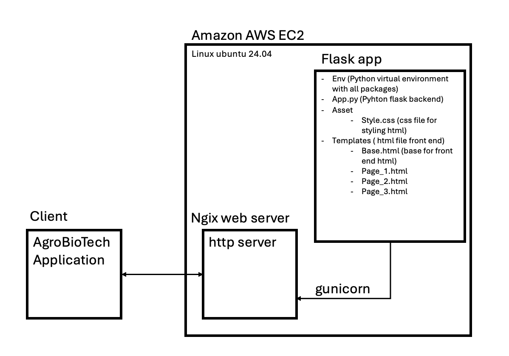

### Introduction 
Création de "l'application" pour le site web AgroBiotech.

Application avec 3 pages:
- Présentation colloc ( et programme )
- Présentation intervenants
- Liens utiles

Backend : Flask (Python)
Frontend : HTML + CSS

### Stratégie d'hébergement web 
Hebergeur web: Amazon AWS EC2 
Choix d'EC2 pour Flask dans l'optique d'implémentation future de 

Serveur : Unbuntu 24.04
WSGI HTTP server : gunicorn 
HTTP web server : nginx

### Structure de l'application 

Ajout futur de formulaire ? 

### ROAD Map
- [x] Creation de l'appplication minimale
- [x] Creation répertoire GitHub
- [x] Essai de déployement de l'application avec Render
- [x] Changement de package back-end Dash -> Flask
- [x] Définition du style front end (inspiration "little sesame")
- [x] Hebergement de l'application sur AWS EC2
- [ ] Développement application front end après définition DA
- [ ] Optimisation de l'application et finalisation
- [ ] Deployement avec Serveur perso ?
- [ ] Phase de test
